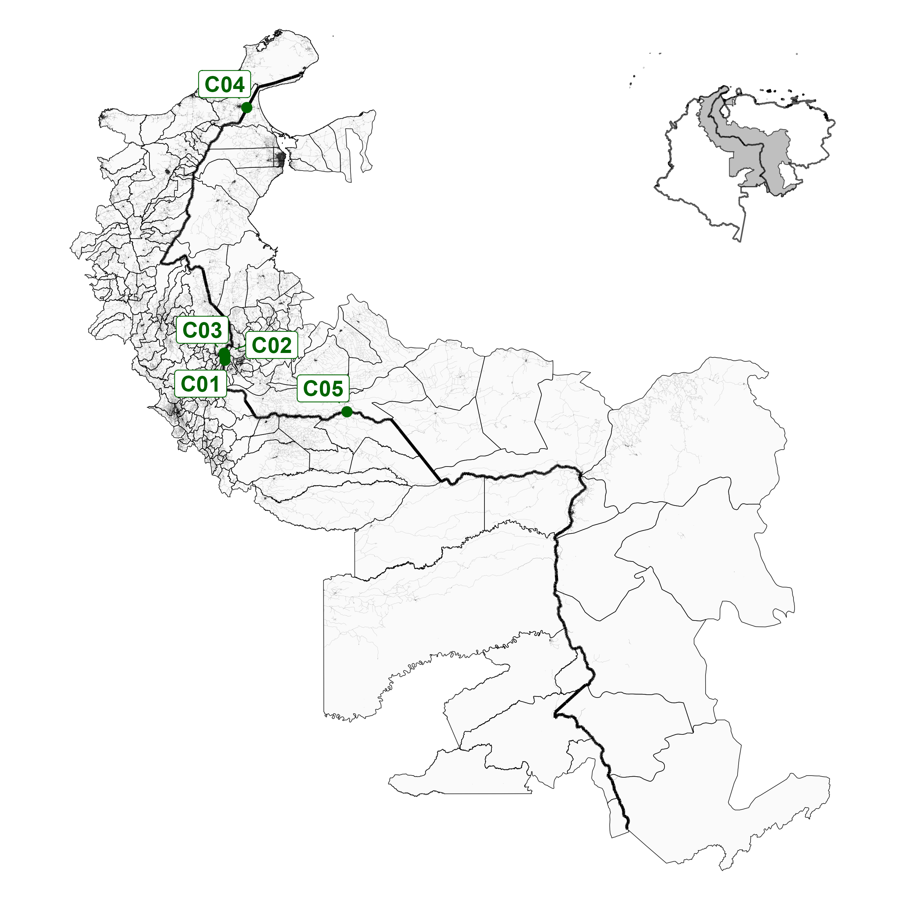
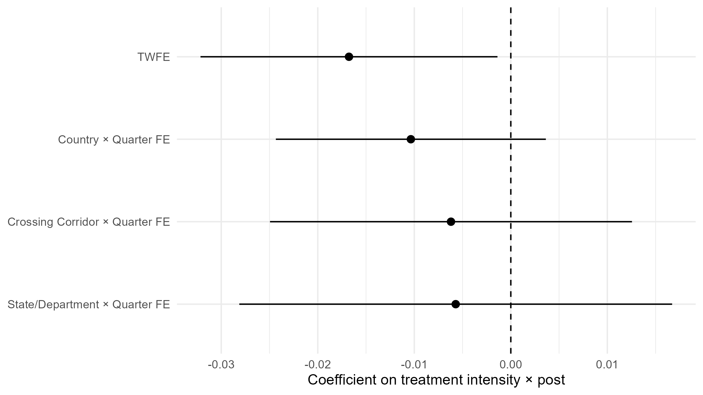
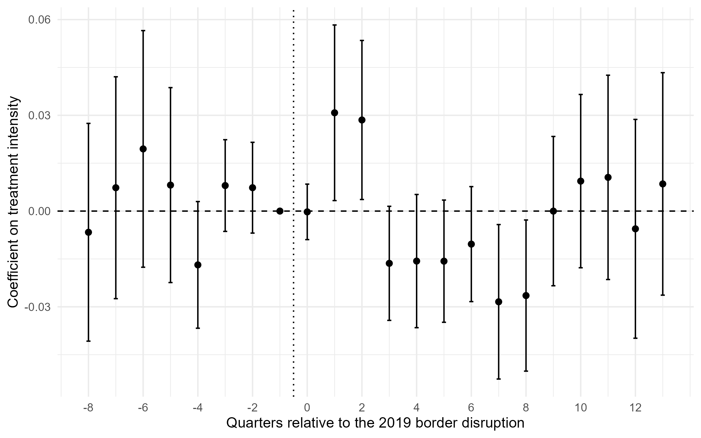
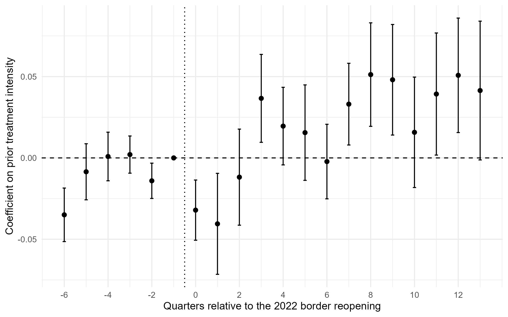
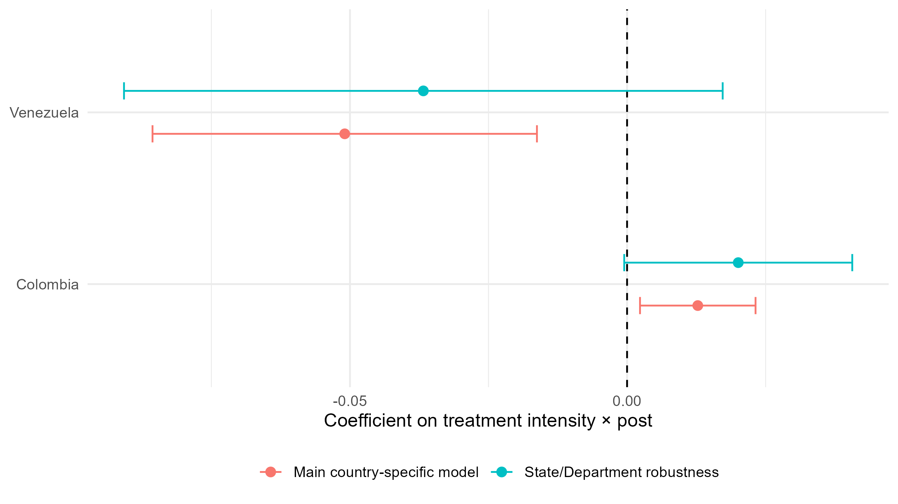
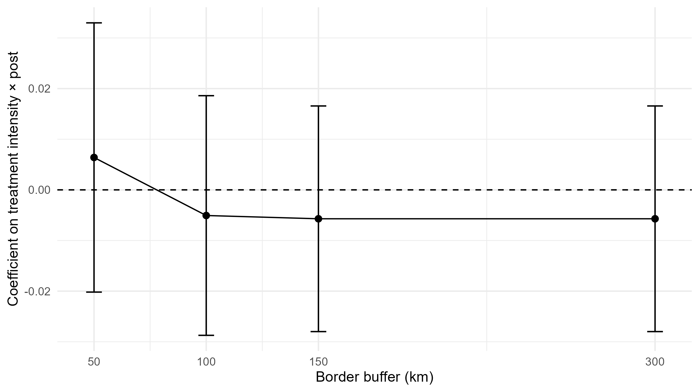
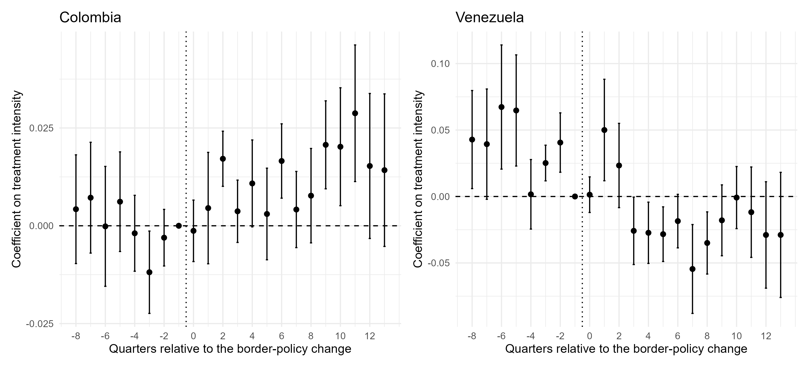

## Motivation

::: {.columns}
:::: {.column width="53%"}
- Border closures can reshape access to markets, suppliers, and jobs.
- In border regions, the relevant shock is often not geography alone, but road-network access to an open crossing.
- The Colombia-Venezuela border is a strong case because formal access changed sharply after 2019.
- Nighttime lights give a quarterly proxy for local economic activity when standard statistics are sparse.

::: {.callout-note}
The talk asks whether municipalities with larger access losses experienced weaker local activity.
:::
::::
:::: {.column width="47%"}
{width=100%}
::::
:::

## Introduction

::: {.columns}
:::: {.column width="52%"}
### Research question

How did changes in road-network access to the Colombia-Venezuela border affect local economic activity?

### Contribution

- Continuous exposure measure based on network distance
- Quarterly municipality panel built from GIS and satellite data
- Border-specific evidence on how access shocks map into local outcomes
::::
:::: {.column width="48%"}
::: {.callout-tip}
### What is new here?

I do not treat the border as a simple dummy. I measure how much the nearest usable crossing effectively moved after restrictions.
:::

::: {.callout-note}
### Why that matters

Two municipalities can sit equally close to the border and still face very different access shocks once roads and crossings are taken seriously.
:::
::::
:::

## Conceptual framework

::: {.concept-grid}
::: {.concept-card}
**Policy shock**  
Border closures and reopenings change which crossings are usable.
:::

::: {.concept-card}
**Transmission channel**  
Road-network detours raise travel cost and weaken cross-border interaction.
:::

::: {.concept-card}
**Outcome**  
Lower accessibility should show up as weaker nighttime-light activity.
:::
:::

::: {.callout-note}
Expected sign: more access loss, lower activity. But the dynamic checks matter for interpretation.
:::

## Methodology

::: {.columns}
:::: {.column width="48%"}
### Empirical pipeline

1. Build a motorcar road network.
2. Compute shortest-path distances to operational crossings.
3. Convert the distance change into treatment intensity.
4. Estimate fixed-effects models and dynamic checks.

### Baseline model

$$
Y_{it} = \alpha_i + \gamma_t + \beta \, Exposure_{it} + \varepsilon_{it}
$$

Then I add more demanding spatial-time controls:

- country x quarter fixed effects
- crossing corridor x quarter fixed effects
- state/department x quarter fixed effects
::::
:::: {.column width="52%"}
::: {.callout-important}
### Identification logic

If the estimated effect survives tighter local time controls, it is more likely to reflect access rather than broader regional shocks.
:::

| Specification | Purpose |
|---|---|
| TWFE | Baseline comparison |
| Country x quarter FE | Absorb national shocks |
| Corridor x quarter FE | Absorb border-system shocks |
| State/department x quarter FE | Absorb local regional shocks |
:::
::::
:::

## Data

::: {.columns}
:::: {.column width="52%"}
| Layer | Source | Role |
|---|---|---|
| Municipalities | Administrative boundaries | Panel units |
| Roads | OpenStreetMap motorcar network | Shortest paths |
| Crossings | Georeferenced border crossings | Access regime |
| Outcome | VIIRS nighttime lights | Quarterly activity |
| Sample | 192 municipalities, 4,032 obs | Estimation sample |

::: {.callout-note}
Quarterly coverage runs from 2012Q2 to 2025Q4.
:::
::::
:::: {.column width="48%"}

  

  

::: {.callout-tip}
Quarterly VIIRS nightlights provide the outcome measure and let the audience see the geography evolve over time.
:::
::::
:::

## Results: Main estimates

::: {.columns}
:::: {.column width="54%"}
{width=100%}
::::
:::: {.column width="46%"}
### Main estimates

- Simple TWFE: -0.0168 (p = 0.033)
- Country x quarter FE: -0.0104 (p = 0.146)
- State/department x quarter FE: -0.0057 (p = 0.616)
- Municipality-specific trends: -0.00043 (p = 0.977)

::: {.callout-note}
The negative coefficient shrinks quickly once tighter local controls are added.
:::
::::
:::

## Results: Dynamic check

::: {.columns}
:::: {.column width="52%"}
{width=100%}
::::
:::: {.column width="48%"}
### Dynamic check

- Event-study estimates show differential pre-trends.
- Joint pre-trend tests reject a flat pre-period in every specification (all p-values < 0.03).
- The dynamic pattern weakens with more localized controls, but it does not disappear completely.
- So the baseline TWFE estimate should be read cautiously.

::: {.callout-important}
This is the main reason I avoid over-claiming a clean causal effect.
:::
::::
:::

## Results: Reopening and heterogeneity

::: {.columns}
:::: {.column width="50%"}
{width=100%}
::::
:::: {.column width="50%"}
{width=100%}
::::
:::

::: {.columns}
:::: {.column width="50%"}
### Reopening check

- Positive reopening coefficient
- Larger past access losses recover more when access is restored
::::
:::: {.column width="50%"}
### Heterogeneity

- Colombia: positive and borderline significant
- Venezuela: negative and significant in the joint model, but less precise in robustness-only estimates
::::
:::

## Conclusion

::: {.callout-important}
### Bottom line

Border accessibility appears to matter, but the strongest evidence is supportive rather than definitive causal proof.
:::

- The GIS and panel pipeline is coherent and reproducible.
- The main effect is sensitive to tighter local time controls.
- The reopening pattern is the clearest mechanism-consistent evidence.

## Landing slide

### Thank you

Jean Pierre Oliveros  
jean.oliveros@uni-oldenburg.de

If you want, I can also show the appendix diagnostics or discuss the measurement choices in detail.

## Appendix: buffer robustness {.appendix-figure}

{width=84%}

## Appendix: country event studies {.appendix-figure}

{width=95%}

## Appendix: summary table

| Item | Value |
|---|---|
| Municipalities | 192 |
| Municipal-quarter observations | 4,032 |
| Countries | 2 |
| Border crossings | 5 |
| Outcome frequency | Quarterly |
| Main outcome | Log(1 + nighttime lights) |

## Appendix: headline estimates

| Specification | Estimate | p-value |
|---|---:|---:|
| TWFE | -0.0168 | 0.033 |
| Country x quarter FE | -0.0104 | 0.146 |
| State/department x quarter FE | -0.0057 | 0.616 |
| Municipality-specific trends | -0.00043 | 0.977 |
